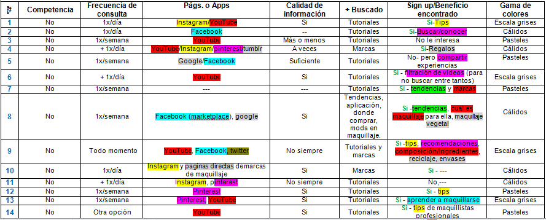
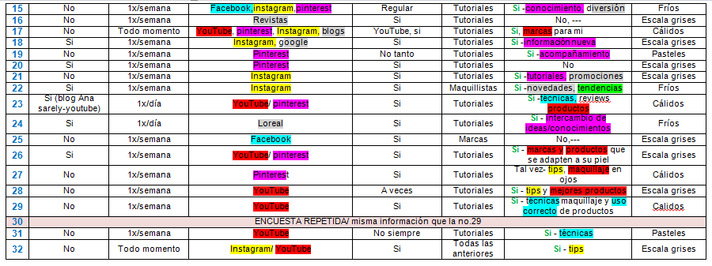
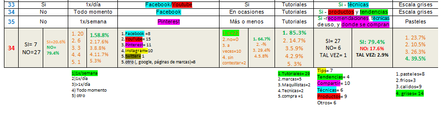
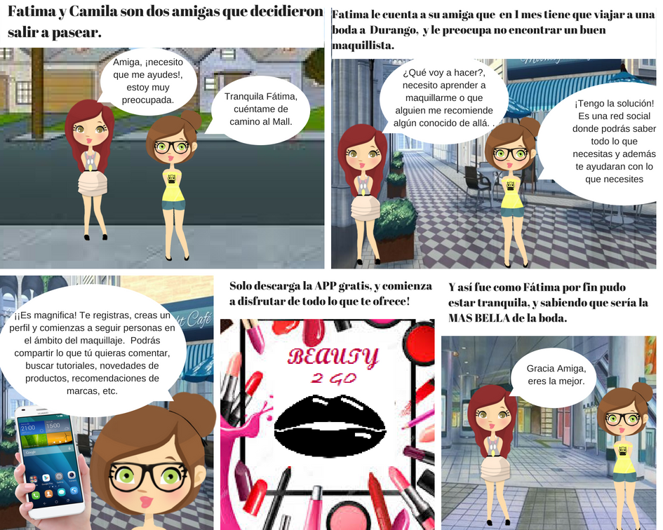

# _Beauty To Go_

* **Integrantes del equipo:** _Francia Vázquez Ornelas, Claudia Trujillo Blanco_
* **Curso:** _Creando tu red social_
***

## Objetivo del producto
##### Requerimientos:
* Perfiles de usuarios.
* Newsfeed donde se puedan ver las actualizaciones de todos los contactos.
* Un post para comentar.
* Tener amigos y poder seguir personas/marcas.
* Diseño mobile friendly.
-----

## Flujo de Trabajo
###### _En esta sección presentamos el flujo de actividades realizadas por el equipo para llegar al objetivo de crear nuestro producto._

El flujo se divide en las siguientes etapas:

#### Investigación:
- Requisitos del cliente..
- Lluvia de ideas para formular la encuesta.
- Realización de entrevistas onlines a personas aleatorias.
- Vaciado de información.
- Análisis de datos.
- Generar hipótesis.

#### Sketching & Prototyping:

- Creación de historia de usuario.
- Justificación.
- Diseño del sketch del flujo de la aplicación.
- Creación de Mockup.

```
Evidencias
```


---

---

---
   
------

## Justificación
###### _Obtenida en base a la investigación realizada_

Se realizaron 34 encuestas de mujeres residentes del estado de Jalisco, las cuales a través de encuestas on-line(google forms) formadas por 7 preguntas, de las cuales 3 fueron de opción múltiple y 4 con respuestas abiertas, se analizó la base de datos global y se llegó a la siguiente conclusión:

Actualmente (1er semestre-2018), de las 34 mujeres encuestadas el **_79.4%_** mencionaron que **_NO EXISTE_** una **_RED SOCIAL EXCLUSIVA DE MAQUILLAJE_**. El **_58.8%_** de estas mujeres al menos **_1 vez/semana_** consultan algo relacionado con el maquillaje a través de **_redes sociales_** establecidas como: _YouTube, Pinterest, Instagram, Facebook_, sin embargo, estas redes sociales no fueron creadas con el fin de consultoría de maquillaje. El **_85.3%_** buscan **_TUTORIALES DE MAQUILLAJE_** en estas redes sociales, pero  solo el 64.7% señalan encontrar información clara a sus consultas y el 29.4% a veces le resulta confusa. Al **_79.4%_** de las encuestadas les **_gustaría inscribirse en una red social de maquillaje_** que tenga como base principal el **_COMPARTIR_** _experiencias, conocimientos e información_. El **_39.5% _** de las encuestadas **_relacionan_** los colores a **ESCALAS DE GRISES** con el **_maquillaje_**.  


## Hipótesis

Crear una **_red social_** enfocada al mundo del **maquillaje**, **_reuniría_** _expertos y gente convencional_ para interactuar de manera instantánea en **_cualquier lugar_** que se encuentre y tenga un **_dispositivo móvil_** con **_red inalámbrica o wi-fi_**, y así **_compartir experiencias_**, novedades e información actualizada, precisa y confiable, satisfaciendo así las necesidades del usuario.

---
## Versiones

- `VERSIÓN 1.0` -
Buscará satisfacer las necesidades primarias de los usuarios focalizadas en las encuestas realizadas. (Consulte la _Hipótesis_).

- `VERSIÓN 1.1` -
Se dará mantenimiento a la versión anterior y se incluirán nuevas sesiones de acuerdo a encuestas de satisfacción que posteriormente se realizara a los usuarios inscritos, para mejorar su experiencia de usuario.

-------

## Historia de usuario


--
Fátima y Camila son dos amigas que decidieron salir un día normal. Fátima pronto tendrá que viajar a una boda fuera de la ciudad, por lo que se encuentra abrumada y estresada ya que no se siente cómoda con tener que viajar y maquillarse ella sola, puesto que no sabe cómo hacerlo y nunca ha viajado a Durango. Fátima no conoce a nadie ni nada allá. Por lo que le comenta a su amiga Camila su situació, pero Camila al ser una mujer a la que siempre le ha interesado y apasionado el mundo del maquillaje descubrió hace poco que existe una App Mobile y la cual utiliza siempre que viaja y  aún más, en cada ocasión especial que tiene. 

En esa App Camila sigue a un grupo de maquillistas profesionales que la orientan en la elección de maquillaje, que suben tutoriales de maquillaje a la moda. Ella comenta sus dudas, así como  las demás personas suscritas, todos interactúan ayudándose en tiempo real. Camila le recomienda la App a su amiga, y Fátima queda fascinada de todo lo que encuentra en la App, ya puede viajar tranquilamente a Durango, sabiendo que podrá recibir ayuda si desea maquillarse ella misma o  recomendaciones de lugares o maquillistas en aquella ciudad que no conoce.


## Sketch del flujo de la aplicación

Link: (aqui va el url del Mockup)
